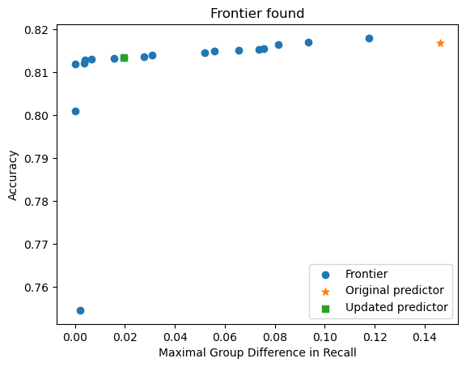

# Using Sklearn and OxonFair

Here we show a simple example of enforcing fairness on a random forest classifier.

The basic approach is the same as for [autogluon](./autogluon.md):

1. Fit a predictor.
2. Create a fairpredictor object using the predictor
3. call fit on the fairpredictor

Step 1 requires considerably more preamble when using sklearn.

    ### load libraries and download the adult dataset

    from sklearn.ensemble import RandomForestClassifier
    import oxonfair as fair
    from oxonfair import group_metrics as gm
    import pandas as pd
    train_data = pd.read_csv('https://autogluon.s3.amazonaws.com/datasets/Inc/train.csv')
    test_data = pd.read_csv('https://autogluon.s3.amazonaws.com/datasets/Inc/test.csv')

    ### merge the datasets, remove the target labels 'class', one hot encode the data, and split into training,test, and validation

    data=pd.concat((train_data, test_data))
    target = data['class']!= ' <=50K'
    data.drop('class',inplace=True,axis=1)
    data = pd.get_dummies(data)
    # get_dumies must be called on all data.
    # Otherwise it breaks if either train and test contain a feature missing from the other.
    train_data = data.sample(frac=0.4)
    train_target = target.iloc[train_data.index]
    val_test = data.drop(train_data.index)
    val_data = val_test.sample(frac=0.5)
    val_target = target.iloc[val_data.index]
    test_data = val_test.drop(val_data.index)
    test_target = target.iloc[test_data.index]

    ### Unlike autogluon much of sklearn breaks if you pass round dataframes 
    ### containing features such as target labels, and groups that are not used by the classifier.
    ### We pass dictionaries that represent the entire dataset to get round this.
    ### They contain 'target' 'data', 'groups' (optional), and 'factor' (optional)
    
    val_dict = fair.build_data_dict(val_target,val_data)
    test_dict = fair.build_data_dict(test_target, test_data) 

## Train a classifier

    pred = RandomForestClassifier().fit(train_data, train_target)

## Create a fair object

and prepare to enforce and evaluate fairness with respect to the variable `sex_ Female`.

    fpred = fair.FairPredictor(pred,val_dict,'sex_ Female')

## Fit the object

Here we call fit to maximize accuracy while ensuring that the difference in recall between the groups is less than 2%.
A wide range of possible performance metrics and fairness measures are supported.

    fpred.fit(gm.accuracy,gm.recall.diff,0.02)

We can now visualize the space of possible trade-offs

    fpred.plot_frontier()

And evaluate on a range of harms both on the validation set where it was enforced, and on the test set

    fpred.evaluate_groups()

|                                    |   Accuracy |   Balanced Accuracy |   F1 score |        MCC |   Precision |    Recall |   ROC AUC |   Number of Datapoints |   Positive Count |   Negative Count |   Positive Label Rate |   Positive Prediction Rate |
|:-----------------------------------|-----------:|--------------------:|-----------:|-----------:|------------:|----------:|----------:|-----------------------:|-----------------:|-----------------:|----------------------:|---------------------------:|
| ('original', 'Overall')            |   0.816964 |          0.707248   |  0.568751  | 0.465341   |    0.674376 | 0.491733  | 0.822921  |                  12320 |             3024 |             9296 |              0.245455 |                  0.178977  |
| ('original', 0)                    |   0.780761 |          0.705794   |  0.587168  | 0.449361   |    0.67979  | 0.51676   | 0.809906  |                   8306 |             2506 |             5800 |              0.30171  |                  0.229352  |
| ('original', 1)                    |   0.891878 |          0.669882   |  0.469438  | 0.433158   |    0.64     | 0.370656  | 0.788724  |                   4014 |              518 |             3496 |              0.129048 |                  0.0747384 |
| ('original', 'Maximum difference') |   0.111118 |          0.0359117  |  0.117731  | 0.0162028  |    0.03979  | 0.146103  | 0.0211828 |                   4292 |             1988 |             2304 |              0.172661 |                  0.154614  |
| ('updated', 'Overall')             |   0.813474 |          0.697572   |  0.552918  | 0.45087    |    0.67155  | 0.469907  | 0.800085  |                  12320 |             3024 |             9296 |              0.245455 |                  0.171753  |
| ('updated', 0)                     |   0.780039 |          0.692925   |  0.564896  | 0.439638   |    0.700532 | 0.473264  | 0.809906  |                   8306 |             2506 |             5800 |              0.30171  |                  0.203829  |
| ('updated', 1)                     |   0.882661 |          0.699946   |  0.499469  | 0.436632   |    0.555556 | 0.453668  | 0.788724  |                   4014 |              518 |             3496 |              0.129048 |                  0.105381  |
| ('updated', 'Maximum difference')  |   0.102622 |          0.00702092 |  0.0654278 | 0.00300641 |    0.144976 | 0.0195962 | 0.0211828 |                   4292 |             1988 |             2304 |              0.172661 |                  0.0984474 |

Evaluate on the test set using

    fpred.evaluate_groups(test_dict)

Evaluate fairness using standard metrics with:

    fpred.evalaute_fairness()

|                                                         |   original |   updated |
|:--------------------------------------------------------|-----------:|----------:|
| Class Imbalance                                         |  0.172661  | 0.172661  |
| Demographic Parity                                      |  0.154614  | 0.0984474 |
| Disparate Impact                                        |  0.325866  | 0.517006  |
| Maximal Group Difference in Accuracy                    |  0.111118  | 0.102622  |
| Maximal Group Difference in Recall                      |  0.146103  | 0.0195962 |
| Maximal Group Difference in Conditional Acceptance Rate |  0.411181  | 0.255626  |
| Maximal Group Difference in Acceptance Rate             |  0.03979   | 0.144976  |
| Maximal Group Difference in Specificity                 |  0.07428   | 0.033638  |
| Maximal Group Difference in Conditional Rejectance Rate |  0.0351948 | 0.0964846 |
| Maximal Group Difference in Rejection Rate              |  0.101413  | 0.120799  |
| Treatment Equality                                      |  0.172428  | 0.28022   |
| Generalized Entropy                                     |  0.102481  | 0.105529  |

Call `fpredict.predict( )`, and `fpredict.predict_proba( )` to score new data.

Once the base predictor has been trained, and the object built, you can use the fair predictor in the same way as with autogluon. See [README.md](./README.md) for details.
